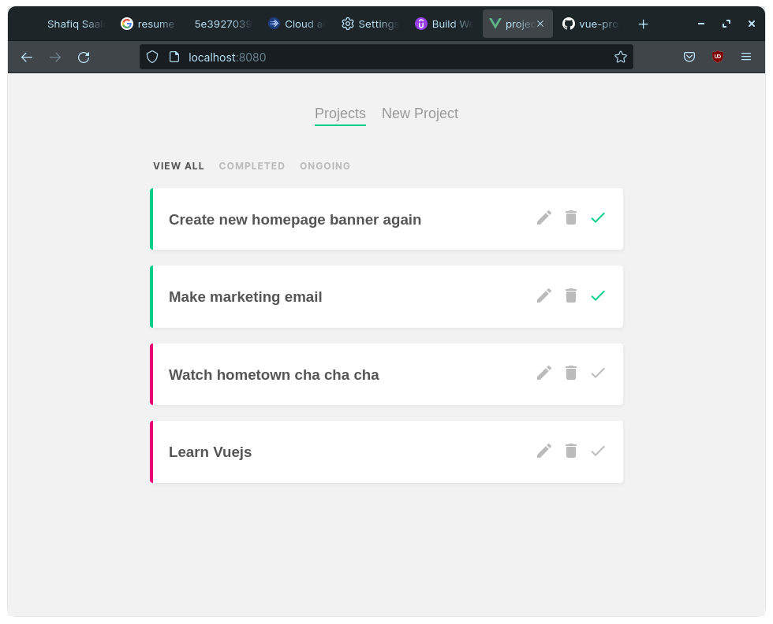
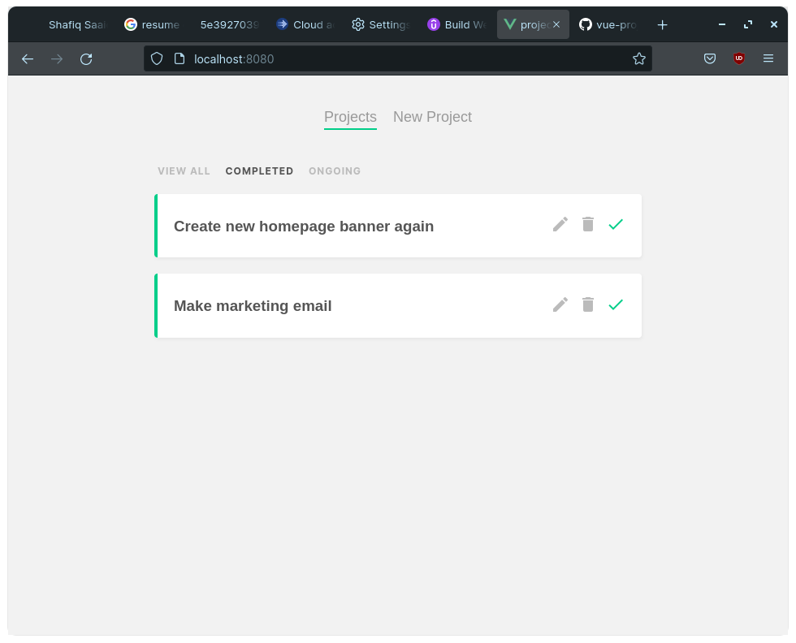

# project-planner

## Project setup
```
npm install
```

### Compiles and hot-reloads for development
```
npm run serve
```
### Run database server
```
npx json-server --watch data/db.json
```

### Compiles and minifies for production
```
npm run build
```

### Project Screenshot
- Homepage

- New project

- Completed project filter

